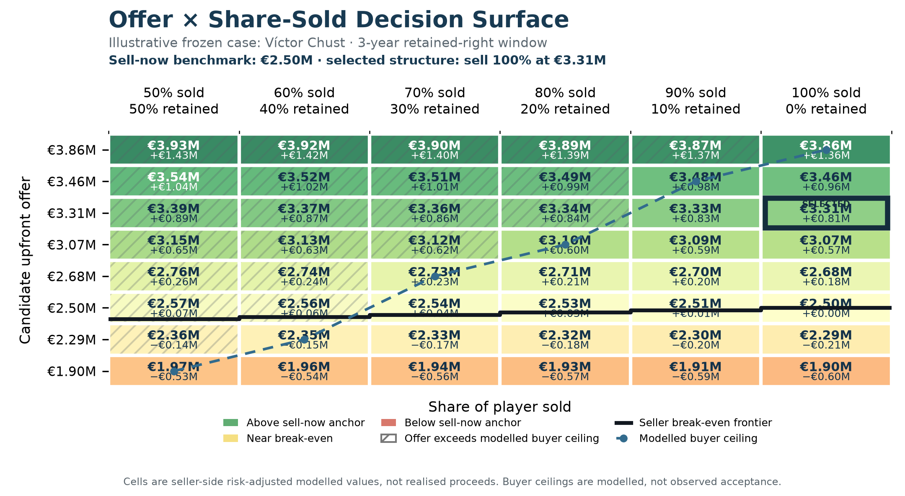
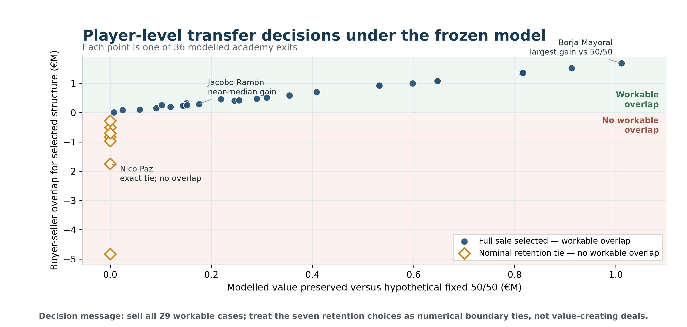

# Sell Now or Keep a Share?

## Risk-Adjusted Optimization of Academy Transfer Structures in Football

This repository accompanies an MIT Sloan Sports Analytics Conference research
submission on academy transfer structures. It asks how a selling club can
compare guaranteed value today with continued economic exposure to a player's
future value without treating every deal as a simple sell-or-keep choice.

## Research question

When an academy player leaves, should the club sell the full economic interest
or retain a right linked to future value? The study formalizes this as an
**offer × share-sold** decision: an upfront offer is evaluated together with
the percentage sold, retained economic exposure, validity window, seller
break-even requirement, and modelled buyer ceiling.

## Why this matters

A retained right can preserve upside, but it can also reduce the upfront fee or
create a structure with no feasible buyer-seller overlap. A useful decision
system must therefore value the whole structure rather than automatically
preferring either immediate cash or future participation.

## Decision framework

The analysis covers **36 modellable Real Madrid academy exits**. Approximately
9,000 historical valuation trajectories support one-, two-, and three-year
value forecasts using information available at the decision date. One- and
two-year values use persistence; the three-year model is a deterministic
400-tree Extra Trees regressor with a log-ratio target.

Forecast scenarios enter a grid of retained shares from 0% to 80% and validity
windows from one to five years. For each structure, the framework estimates:

- the candidate upfront offer;
- the risk-adjusted retained component;
- the seller's break-even upfront amount;
- a modelled buyer ceiling;
- whether a feasible negotiation region exists; and
- the resulting risk-adjusted modelled club value.

## Key findings

| Policy | Modelled portfolio value |
|---|---:|
| Player-specific selection | **€172.37M** |
| Full sale | **€172.37M** |
| Hypothetical fixed 50/50 | **€161.65M** |

The player-specific framework is **€10.72M** above the hypothetical fixed
50/50 rule, a relative difference of **6.63%**, or approximately **€297,860 per
modelled exit**. Lower or higher retained-share arrangements were not observed
club policy here; fixed 50/50 is a deliberately simple hypothetical benchmark.

The default selection contains **29 full sales** and **seven nominal retention
selections**. All seven are numerical ties with full sale, add **€0 additional
modelled value**, and lack workable buyer-seller overlap. The result therefore
does not show that retained shares created €10.72M or that optimization beat
full sale. It shows that a player-specific framework avoids the modelled loss
from mechanically imposing the same 50/50 structure on every exit.

Across **1,500 sensitivity configurations**, player-specific selection remains
above fixed 50/50. The difference has P10 **€5.5M**, median **€15.7M**, and P90
**€33.6M**. These checks remain conditional on the study assumptions.

## Figures

### Player-level decision mechanism



**Figure 1.** An illustrative player-level surface. Each cell combines an
upfront offer with the share sold and retained component. The solid staircase
marks seller break-even, the dashed line is the modelled buyer ceiling, and
hatched cells exceed that ceiling. Values are modelled, not realised proceeds.

### Cohort-level decisions



**Figure 2.** The 36-exit cohort. All 29 workable cases select full sale; seven
nominal retention selections are value-neutral boundary ties without workable
overlap. The horizontal comparison is against hypothetical fixed 50/50, not
observed club decisions.

## Methodology

The complete scientific definitions, frozen calibration, forecast design, and
sensitivity protocol are summarized in [Methodology](docs/METHODOLOGY.md).
The approved two-page paper is available [here](paper/Problem1_Sell_Now_or_Keep_a_Share_Risk_Adjusted_Optimization_of_Academy_Transfer_Structures_in_Football.pdf).

## Repository structure

```text
paper/      sanitized two-page public paper
figures/    final publication figures
results/    aggregate frozen results used for verification
src/        public-safe economic primitives
scripts/    headline reproduction and release validation
data/       data-availability statement; no row-level data
docs/       methodology, provenance, reproducibility, and limitations
```

## Reproducing the public results

```bash
python -m venv .venv
source .venv/bin/activate
python -m pip install -r requirements.txt
python scripts/reproduce_headlines.py
python scripts/validate_public_release.py
```

The public package provides **partial reproducibility**. Aggregate claims can
be recomputed and validated, and the economic primitives are inspectable. Full
forecast training and player-level optimization require source data that are
not redistributed. See [Reproducibility](docs/REPRODUCIBILITY.md) and
[Data provenance](docs/DATA_PROVENANCE.md).

## Limitations

The reported values are modelled, not realised transfer proceeds or accounting
profit. Market value is not transfer fee. Buyer acceptance is modelled rather
than observed, and the framework does not recover historically optimal
contracts. Buyer behaviour, complete contract terms, clause enforcement, and
realised retained-right payouts are not directly observed. The study is
simulation-based and observational; its findings are not causal. See the full
[limitations](docs/LIMITATIONS.md).

## Author

### Rupayan Halder

Repository author and maintainer. [GitHub](https://github.com/RupayanHalder39)

## Research Collaboration

This research was developed in collaboration with SoccerSolver. SoccerSolver currently works with more than 10 football clubs.

## Citation

Use the metadata in [`CITATION.cff`](CITATION.cff).

## Licence

Original repository code is released under the [MIT License](LICENSE). This
does not grant redistribution rights for excluded third-party or proprietary
data, trademarks, or external content. See [Data provenance](docs/DATA_PROVENANCE.md).
